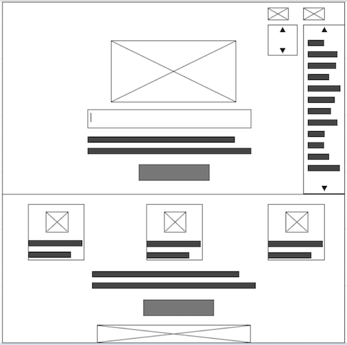

# Development Strategy

> `Duck-duck-clone`

- This project is clone of the home page of the web-site DuckDuckGo.com with applying html, css,  incremental-development, adding git-branches per every step of dev-strategy, merging by pull-request and closes issues with colaborating of 2 students. 
- This project would interest for novice students of web-development because there is example of applying colaborating and incremental-development.

## Wireframe

## 0. Set-Up

__A User can see my initial repository and live demo__

### Repo

- Generate from Template
- Write initial, basic README
- Turn on GitHub Pages

## 1. Navigation-bar

__As visitor I expect see useful and simple menu with main parts of web-site__

### Repo

developed on a branch called `nav`

### HTML

- add drop-down list with names of networks
- add slide-menu from the right-side with site-map for effect appearing and disappearing menu use `lable-tag`

### CSS

- for visual effect of use selector `hover` and property `display-block`
- for enhance of visual effect appearing and disappearing menu use property `transition`
- use contrast font and background
- use color small icon from [fontawesome.com](https://kit.fontawesome.com/)

----

## 2. Logo with search-field and submit button

__As visitor I expect see simple colorfull  and attractive part, which tell me what I can find on this web-site__

### Repo

developed on a branch called `intro`

### HTML

- add logo
- add search-field
- add text for introduction
- add button

### CSS

- add style for search-field, button and text
- add media-queries

----

## 3. Features 

__As visitor I want to have more content about privacy statement of duckduckgo and a button so that to add duckduckgo extetion for chrome__

### Repo

developed on a branch called `info-content`

### HTML

- add content info
- add content title
- add content info items with 3 items 
- add icons for the each item
- add privacy statement title and subtitle 
- add button for duckduckgo chrome extention

### CSS

- add style for search-field, button and text
- add media-queries

-----

## 4. Footer  

__As a visitor I want to have  nice image with a monster who eats the personaldata__

### Repo

developed on a branch called `info-content`

### HTML

-add an image to the footer

### CSS

- add style for the image

----

## Finishing Touches

- Write final, complete README:
- Validate code to check for any last mistakes
